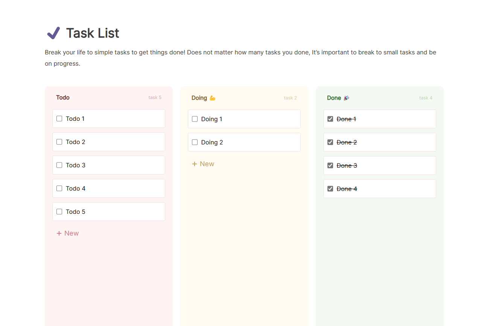

# About
## This is a simple example of Todo's site.
### Add Task
### Edit Task
### Remove task
### Move Task
### And the task is done.
#### It was a request from the employer to implement the Todo project without using the CRA(Create React App).


# Installation
```shell
$ git clone ...
$ cd todoApp
$ npm install
$ npm run start || npm run start-win
```

# Screenshot


